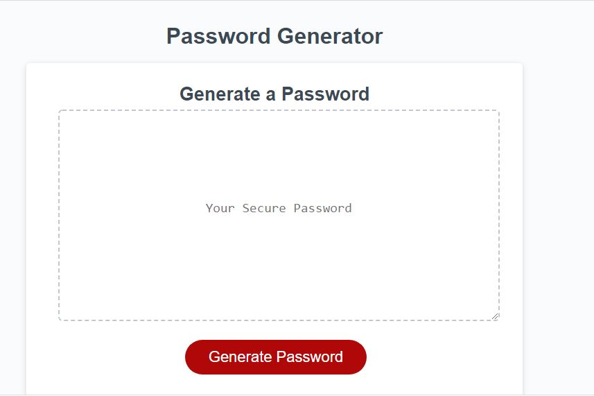

# password-generator

Link to deployed website: https://asharif123.github.io/password-generator/

Password Generator is a website that gives users the opportunity to create their own password!

When the user clicks on "Generate Password", it will prompt user to enter between 8 to 128 characters and what character types to include in the password.

These character types are if user wants to add lowercase, uppercase, special characters and numbers. User must make one character type selection or else user has to start the whole process over of creating a password.

The final step is the user will be able to see their generated password in the textbox.

This was created using HTML, CSS and Javascript where Javascript was used to generate prompts when user hits "Generate Password" and to also generate the random password and paste it in the textbox area.

Here are the screenshots:

This screenshot represents the main webgape user sees where the user can click on "Generate Password" button to create unique password.

